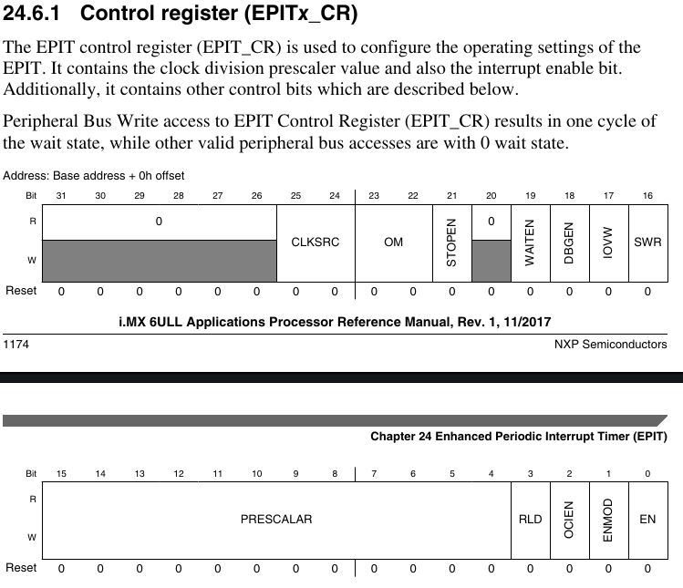

### EPIT结构图

EPIT有三个时钟源：`ipg_clk`、`ipg_clk_32k`、`ipg_clk_highfreq`，经过MUX后进入一个12bit的分频器，产生的时钟信号用于产生计数即`Counter Register`。计数器可以和预置号的比较寄存器内容比较，如果相等则向后输出中断信号，同时`Counter Register`会置0。

imx6ull中，EPIT模块会产生两个外部信号（外部信号可能引起中断，也可能不会）。

EPIT有两种工作方式，`set-and-forget`和`free-running`其实就是计数上限的问题。`set-and-forget`可以设定`EPIT_LR`寄存器，从寄存器的值开始递减，到0时又重新从这里加载。`free-running`则从FFFFFFFF开始递减。选择使用哪个模式可以通过调整`EPIT_CR`中的`RLD`位切换

### 配置EPIT

主要通过`EPIT_CR`完成

这里我们需要配置`EN`，`ENMOD`，`RLD`， `PRESCALAR`和`CLKSRC`

另外我们还要向`EPIT_CMPR`中写入比较值，在`EPIT_LR`中写入初始加载值。在写EPIT中断处理函数的时候还要记得将`EPIT_SR`中的对应位置清零（这个是写1清零）

