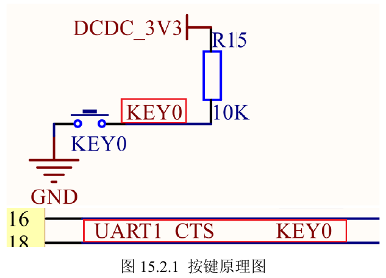
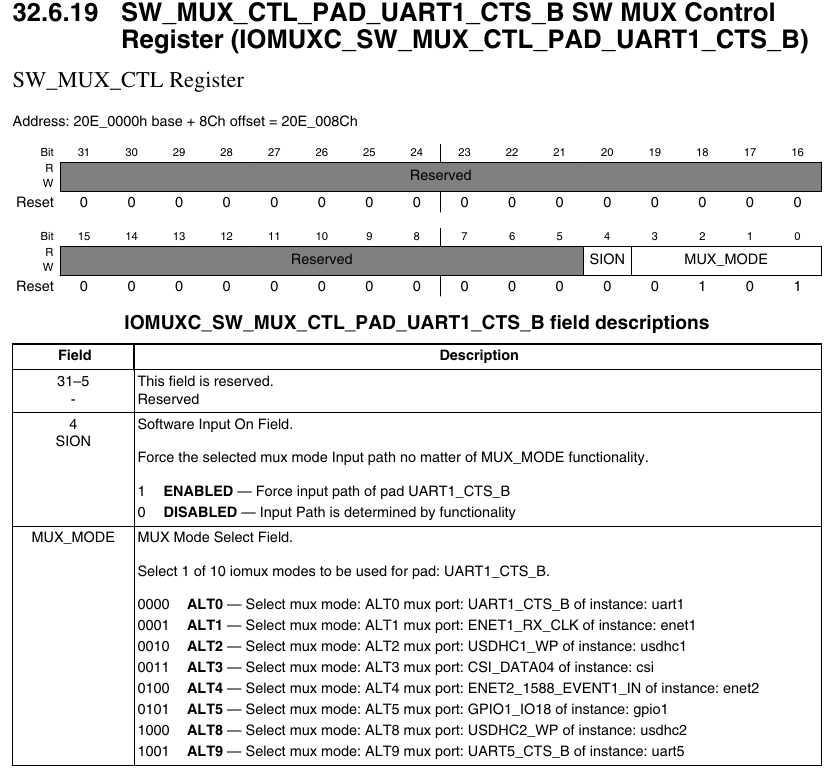
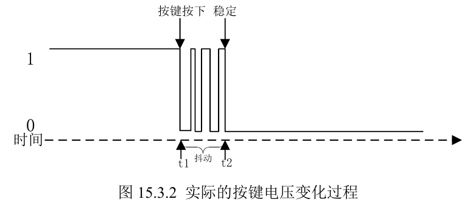

### 代码

`key0`的原理实现如下



`key0`接入物理引脚`UART1_CTS`的引脚。该引脚默认上拉，按下按键后变为低电平。在手册中对应



在移植代码的过程中，我们在`pin_macro.h`的文件中存储了复用宏的信息。我们将`UART1_CTS_B`复用为`GPIO1_IO18`引脚即可通过`key0`按键对`GPIO1`进行输入操作。首先给出`key.h`头文件

```c
#ifndef _KEY_H
#define _KEY_H

#include<imx6ull.h>

enum key_value{
    KEY_PRESS = 0,
    KEY_RELEASE = 1
};

void key_init(void);
int key_getvalue(void);

#endif
```

然后是函数定义代码`key.c`

```c
#include "key.h"
#include "delay.h"

void key_init(void)
{
    IOMUXC_SetPinMux(IOMUXC_UART1_CTS_B_GPIO1_IO18, 0);
    IOMUXC_SetPinConfig(IOMUXC_UART1_CTS_B_GPIO1_IO18, 0xF080);
    GPIO1->GDIR &= ~(1 << 18);
}

int key_getvalue(void)
{
    if (GPIO1_DR_READ_BIT(18) == 0){
        delay(10);
        if (GPIO1_DR_READ_BIT(18) == 0)
            return KEY_PRESS;
        else
            return KEY_RELEASE;
    }
    else
        return KEY_RELEASE;
}
```

由于按键的机械特性，当我们按下按键的时候，引脚电平不一定会马上变成低电平，而是可能出现抖动的现象，这就需要我们使用延迟读的技巧，保持当前读出来的低电平不是由于扰动而引起的“假低电平”



`main.c`的主函数文件如下

```c
#include "imx6ull.h"
#include "clock.h"
#include "beep.h"
#include "led.h"
#include "delay.h"
#include "key.h"

int main(void)
{
    clock_enable_all_cg();
    beep_init();
    led_init();

    unsigned int counter = 0;

    while (1)
    {
        counter = (counter + 1) % UINT32_MAX;
        delay(1);
        if(counter % 200 == 0){
            if(key_getvalue() == KEY_PRESS){
                beep_on();
            }
            else{
                beep_off();
            }
        }
        if(counter % 1000 == 0){
            led_switch();
        }
    }
    return 0;
}
```

这里我们设置每隔200个时间间隔扫描一次接口，如果接口读出按键按下，那么蜂鸣器响，否则当按键松开的时候，蜂鸣器停。led等每隔1000个时间间隔闪烁一次以提示系统正在运行。

> 这里我们因为没有实现中断，所以三个物理接口是串行工作的。
