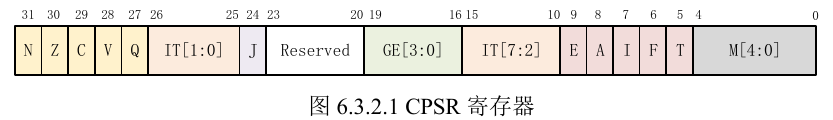
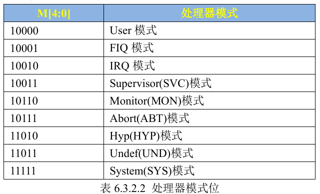

### 构建C语言环境

两个先决条件：

1. 启动监管模式，即设置`cpsr`寄存器对应位置。
   
   设置`cpsr`寄存器的时候，应该使用`msr`指令和`mrs`指令。
   
   ```asm
   mrs r0, cpsr
   bic r0, r0, #0x1f @清除原来的低5位
   orr r0, r0, #0x13 @设置新的低5位，对应监管模式的代码
   mrs r0, cspr @进入svc模式
   ```
   
   > 关于`cspr`：**CPSR** 是 **Current Program Status Register**（当前程序状态寄存器）的缩写，它是 ARM 架构中的一个重要寄存器，用于存储处理器的当前状态和控制信息。CPSR 寄存器在 ARM 处理器中扮演着核心角色，主要用于管理处理器的运行模式、条件标志、中断使能等。
   > 
   > 
   > 
   > | 位域   | 名称             | 描述                           |
   > | ---- | -------------- | ---------------------------- |
   > | 31   | N（Negative）    | 结果为负时置 1。                    |
   > | 30   | Z（Zero）        | 结果为零时置 1。                    |
   > | 29   | C（Carry）       | 发生进位或借位时置 1。                 |
   > | 28   | V（Overflow）    | 发生溢出时置 1。                    |
   > | 27   | Q（Saturation）  | 饱和运算发生时置 1（仅在某些 ARM 处理器中支持）。 |
   > | 26-8 | 保留             | 保留位，通常为 0。                   |
   > | 7    | I（IRQ disable） | 禁用 IRQ 中断时置 1。               |
   > | 6    | F（FIQ disable） | 禁用 FIQ 中断时置 1。               |
   > | 5    | T（Thumb state） | 处于 Thumb 指令集模式时置 1。          |
   > | 4-0  | Mode bits      | 处理器模式（如用户模式、IRQ 模式、FIQ 模式等）。 |
   > 
   > 可以看到模式位占5位，不同模式的代码如下
   > 
   > 

2. 设置栈指针（也就是为`main`函数设置指针）
   
   设置`sp`的时候，应该考虑栈的大小。因为栈是向下增长（向低地址增长），那么`sp`设置的地址越高，则栈的大小越大；反之越小。这里我们设置栈指针指向`0x80010000`则可用的字节为65536B
   
   ```asm
   ldr sp, =0x80010000
   b main
   ```

### **程序的常见段**

#### **`.text` 段**

- **内容**：存储程序的**代码**（即机器指令）。

- **属性**：只读、可执行。

- **作用**：存放程序的执行逻辑。

#### **`.rodata` 段**

- **内容**：存储**只读数据**（如字符串常量、常量数组等）。

- **属性**：只读。

- **作用**：存放不需要修改的常量数据。

#### **`.data` 段**

- **内容**：存储**已初始化的全局变量和静态变量**。

- **属性**：可读写。

- **作用**：存放程序运行时需要修改的已初始化数据。

#### **`.bss` 段**

- **内容**：存储**未初始化的全局变量和静态变量**。

- **属性**：可读写。

- **作用**：存放程序运行时需要修改的未初始化数据。

> `.bss`段通常设置为0，即这一段区域的大小设置为0，这样子设置一是保证各全局变量和静态变量初始化为0，并减少这一部分变量的空间浪费；二是`.bss`段也是动态增长的，并不是一成不变，更加有效利用空间。

#### **`.heap` 段**

- **内容**：动态分配的内存（如 `malloc` 分配的内存）。

- **属性**：可读写。

- **作用**：存放程序运行时动态分配的数据。

#### **`.stack` 段**

- **内容**：存储**函数调用的栈帧**（如局部变量、函数参数、返回地址等）。

- **属性**：可读写。

- **作用**：支持函数调用和局部变量的存储。

### C程序的编写

方便起见，我们在头文件中定义各个寄存器地址的宏保证主程序的可读性。

```c
#ifndef __CONFIGURE_H
#define __CONFIGURE_H

//定义CCM寄存器地址
#define CCM_CCGR0 *((volatile unsigned int*)0x020C4068)
#define CCM_CCGR1 *((volatile unsigned int*)0x020C406C)
#define CCM_CCGR2 *((volatile unsigned int*)0x020C4070)
#define CCM_CCGR3 *((volatile unsigned int*)0x020C4074)
#define CCM_CCGR4 *((volatile unsigned int*)0x020C4078)
#define CCM_CCGR5 *((volatile unsigned int*)0x020C407C)
#define CCM_CCGR6 *((volatile unsigned int*)0x020C4080)

//定义所需要用到的IO复用寄存器地址
#define IOMUXC_SW_MUX_CTL_PAD_GPIO1_IO03 *((volatile unsigned int*)0x020E0068)
#define IOMUXC_SW_PAD_CTL_PAD_GPIO1_IO03 *((volatile unsigned int*)0x020E02F4)

//定义配置GPIO寄存器
#define GPIO1_DR *((volatile unsigned int*)0x0209C000)
#define GPIO1_GDIR *((volatile unsigned int*)0x0209C004)

#endif
```

这里注意我们要把宏定义成地址解引用的形式

```c
#include "configure.h"

void _register_init_(){
    CCM_CCGR0 = 0xFFFFFFFF;
    CCM_CCGR1 = 0xFFFFFFFF;
    CCM_CCGR2 = 0xFFFFFFFF;
    CCM_CCGR3 = 0xFFFFFFFF;
    CCM_CCGR4 = 0xFFFFFFFF;
    CCM_CCGR5 = 0xFFFFFFFF;
    CCM_CCGR6 = 0xFFFFFFFF;

    IOMUXC_SW_MUX_CTL_PAD_GPIO1_IO03 = 0x5;
    IOMUXC_SW_PAD_CTL_PAD_GPIO1_IO03 = 0x10B0;

    GPIO1_DR = 0x0;
    GPIO1_GDIR = 0x8;
}

void led_off(){
    GPIO1_DR = 0xFFFFFFFF;
}

void led_on(){
    GPIO1_DR = 0x0;
}

void delay(){
    volatile unsigned int time = 0x7ff;
    while(time--){};
}

void led_blink(volatile unsigned int n){
    led_off();
    for(int i = 0; i < n; i++){delay();};
    led_on();
    for(int i = 0; i < n; i++){delay();};
}

int main(){
    _register_init_();

    while(1){
        led_blink(1000);
    }

    return 0;
}
```

在主程序中，我们定义了寄存器初始化函数`_register_init_()`用于设置`GPIO`引脚和初始化，开关函数`led_on()`和`led_off()` ，闪烁函数`led_blink()`。主程序设置一个死循环实现开发板led等闪烁。

### makefile文件书写

```makefile
.PHONY: clean write

objs = start.o main.o

ledc.bin : $(objs)
    arm-linux-gnueabihf-ld -T imx.lds $^ -o ledc.elf
    arm-linux-gnueabihf-objcopy -O binary -S -g ledc.elf ledc.bin
    arm-linux-gnueabihf-objdump -D -m arm ledc.elf > ledc.dis

# -Wall是启动警告输出
%.o : %.c
    arm-linux-gnueabihf-gcc -nostdlib -c -Wall -o $@ $< 

%.o : %.s
    arm-linux-gnueabihf-gcc -nostdlib -c -Wall -o $@ $< 

%.o : %.S
    arm-linux-gnueabihf-gcc -nostdlib -c -Wall -o $@ $< 

write : ledc.bin
    cat header ledc.bin > ledc.imx
    sudo uuu ledc.imx

clean:
    rm -f *.o *.imx *.dis *.elf *.bin
```

这次我们使用了更多的自动化变量以及隐式规则

> `Makefile` 的隐式规则（Implicit Rules）是 `make` 工具提供的一种自动化机制，用于简化编译过程的编写。隐式规则可以根据文件扩展名自动推导出如何从源文件生成目标文件，从而减少手动编写规则的工作量。
> 
> ---
> 
> #### **隐式规则的工作原理**
> 
> 隐式规则基于文件扩展名和目标依赖关系。`make` 工具内置了一些常见的隐式规则，例如：
> 
> - 从 `.c` 文件生成 `.o` 文件。
> - 从 `.cpp` 文件生成 `.o` 文件。
> - 从 `.o` 文件生成可执行文件。
> 
> 当 `make` 发现某个目标文件没有显式规则时，它会尝试使用隐式规则来生成该目标文件。
> 
> ---
> 
> #### **常见的隐式规则**
> 
> ##### **从 `.c` 文件生成 `.o` 文件**
> 
> `make` 内置了从 `.c` 文件生成 `.o` 文件的隐式规则，其形式如下：
> 
> ```makefile
> %.o: %.c
>     $(CC) $(CFLAGS) -c $< -o $@
> ```
> 
> - `%` 是通配符，匹配任意文件名。
> - `$<` 表示第一个依赖文件（即 `.c` 文件）。
> - `$@` 表示目标文件（即 `.o` 文件）。
> 
> ##### **从 `.o` 文件生成可执行文件**
> 
> `make` 还内置了从 `.o` 文件生成可执行文件的隐式规则，其形式如下：
> 
> ```makefile
> %: %.o
>     $(CC) $(LDFLAGS) $< -o $@
> ```
> 
> ---
> 
> #### **自定义隐式规则**
> 
> 除了使用内置的隐式规则，还可以自定义隐式规则。例如，定义一个从 `.cpp` 文件生成 `.o` 文件的隐式规则：
> 
> ```makefile
> # 定义编译器和编译选项
> CXX = g++
> CXXFLAGS = -Wall -O2
> 
> # 自定义隐式规则
> %.o: %.cpp
>     $(CXX) $(CXXFLAGS) -c $< -o $@
> 
> # 最终的可执行文件
> my_program: main.o utils.o
>     $(CXX) $(CXXFLAGS) main.o utils.o -o my_program
> 
> # 清理生成的文件
> clean:
>     rm -f my_program *.o
> ```

### 链接脚本书写

在本次实验中，我们需要按照指定顺序链接多个可链接文件，如果按照`gcc`的默认链接顺序可能会出现我们不想要的结果，这个时候需要我们指定最终程序的布局，需要使用链接脚本来指定。

```linker-script
SECTIONS{
    . = 0x80100000;
    .text : {
        start.o
        main.o
        *(.text)
    }
    .rodata ALIGN(4) : {*(.rodata)}
    .data ALIGN(4) : {*(.data)}
    __bss_start = .;
    .bss ALIGN(4) : {*(.bss)}
    __bss_end = .;
}
```

这里我们规定了若干段的布局方式。`.`是一个特殊符号，在链接脚本中叫做定位计数器（定义当前地址，后续段从这个地址开始），默认的定位计数器为0，如果我们要将代码链接到指定位置，就要设置计数器到对应的地址上去。

`.text`段是存放代码的段，注意根据语法要求冒号`:`前后要用空格分割。花括号括起来的部分就是我们所有可链接脚本的布局，可以看到首先是`start.o`，然后是`main.o`，`*(.text)`表示剩余的其他代码。

`.rodata`即read only data，`.data`即数据段，这些不用变

`.bss`存储**未初始化的全局变量和静态变量**。这一段通常通过设置`__bss_start`和`__bss_end`相等实现清零。

> 我们通过使用测试变量`test_ext`，并调整链接脚本中`.bss`段的位置到最前面，可以看到其实`.bss`段并不是真的为0，是动态变化的。
> 
> ```c
> double test_ext
> ```
> 
> 调整链接脚本
> 
> ```linker-script
> SECTIONS{
>     . = 0x80100000;
>     .bss ALIGN(4) : {
>         *(.bss)
>         *(.COMMON)
>     }
>     .text : {
>         start.o
>         main.o
>         *(.text)
>     }
>     .rodata ALIGN(4) : {*(.rodata)}
>     .data ALIGN(4) : {*(.data)}
>     __bss_start = .;
> 
>     __bss_end = .;
> }
> ```
> 
> 查看反汇编
> 
> ```asm
> Disassembly of section .text:
> 
> 80100008 <_start>:
> 80100008:    e10f0000     mrs    r0, CPSR
> 8010000c:    e3c0001f     bic    r0, r0, #31
> ...
> ```
> 
> 其实呢，链接脚本不用写`.bss`段相关的东西也可以通过编译，默认会把`.bss`放在后面的地方。这里用链接脚本是为了保证`start.o`能在`main.o`前面而已。

此外还有`.stack`和`.heap`段。
