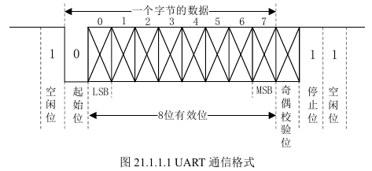
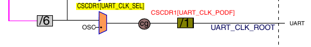
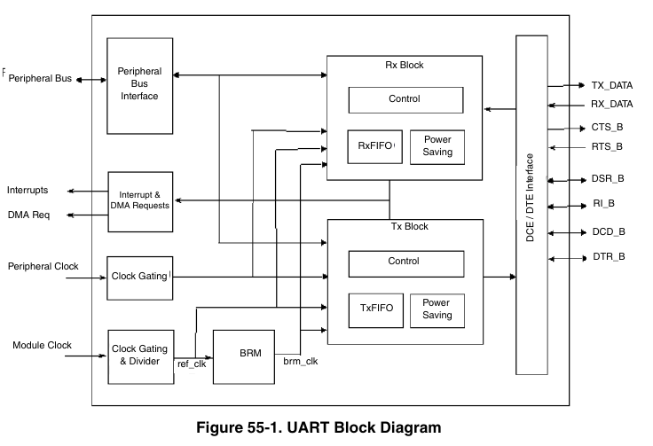
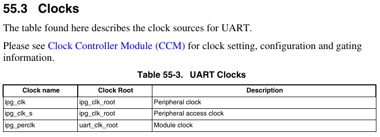

### 关于UART

一种串口，工作原理是将数据一位一位串行传输，发送和接受全双工。故UART接口连接只需要三根线：`TXD`、`RXD`、`GND`分别为发送线，接受线，地线。传输格式如下



UART的接口一般是TTL（可以转USB接口）和RS-232（9孔接口）。

### UART的时钟

见CCM章节



其中粉色的线是`pll3_sw_clk`，是PLL3输出的时钟信号。而在UART章节中，可以看到UART其实接入了两个时钟



这里的Module Clock就是上面的`UART_CLK_ROOT`，而上面的Peripheral Clock是`IPG_CLK`



### 使用UART串口通信

- 配置时钟源（配置`CCM_CSCDR1`的`UART_CLK_SEL`位为0，其实不用设置，默认复位就可以）

- 初始化UART的IO接口属性，配置波特率，奇偶校验，数据位长度，停止位等

- 完成UART中断函数的处理，使能UART

- 封装收发函数

```c
void UART1_Init(){
    UART1_IO_Init();//set pin

    UART_Disable(UART1);
    UART_SoftReset(UART1);
    Beep_ON();
    delay(50);
    Beep_OFF();
    UART1->UCR1 = 0;//set UCRs
    UART1->UCR1 &= ~UART_UCR1_ADBR(0x1);
    UART1->UCR2 |= UART_UCR2_IRTS(0x1);
    UART1->UCR2 |= UART_UCR2_WS(0x1);
    UART1->UCR2 |= UART_UCR2_TXEN(0x1);
    UART1->UCR2 |= UART_UCR2_RXEN(0x1);
    UART1->UCR3 |= UART_UCR3_RXDMUXSEL(0x1);

    //Baud Rate = Ref Freq / (16 * (UBMR + 1)/(UBIR+1))
    /* let baudrate = 115200, Ref = 80M(div 1), UBMR = 3124, UBIR = 71 */
    UART1->UFCR |= UART_UFCR_RFDIV(0x5);
    UART1->UBIR = 71;
    UART1->UBMR = 3124;
    UART_Enable(UART1);

}

void UART_SoftReset(UART_Type *base){
    base->UCR2 &= ~UART_UCR2_SRST(0x1);
    while((base->UCR2 & UART_UCR2_SRST_MASK) == 0);
}

void UART1_IO_Init(){
    IOMUXC_SetPinMux(IOMUXC_UART1_TX_DATA_UART1_TX, 0);
    IOMUXC_SetPinMux(IOMUXC_UART1_RX_DATA_UART1_RX, 0);
    IOMUXC_SetPinConfig(IOMUXC_UART1_TX_DATA_UART1_TX, 0x10B0);
    IOMUXC_SetPinConfig(IOMUXC_UART1_RX_DATA_UART1_RX, 0x10B0);
}

void UART_Disable(UART_Type *base){
    base->UCR1 &= ~UART_UCR1_UARTEN(0x1);
}

void UART_Enable(UART_Type *base){
    base->UCR1 |= UART_UCR1_UARTEN(0x1);
}

void _putc(uint8_t c){
    while((UART1->USR2 & UART_USR2_TXDC_MASK) == 0);
    UART1->UTXD = (c & 0xFF);
}
void _puts(uint8_t* s){
    while(*s){
        _putc(*s);
        s++;
    }
}
uint8_t _getc(){
    while((UART1->USR2 & UART_USR2_RDR_MASK) == 0);
    return UART1->URXD;
}

void raise(){}//reserved for libgcc.a
```

### 关于格式化输出

一个关键的功能是实现可变参数数量的参数传递。在函数声明的时候使用`...`表示可以传递任意数量的参数

```c
void sprintf(const char *s, ...);
```

使用可变参数之后，编译器会使用传栈（而不是传寄存器）的方式来传递参数。这里我们首先定义几个工具宏展开

```c
typedef char* va_list;
/*
 * Storage alignment properties
 */
#define     NATIVE_INT         int
#define  _AUPBND         (sizeof (NATIVE_INT) - 1)
#define  _ADNBND         (sizeof (NATIVE_INT) - 1)

/*
 * Variable argument list macro definitions
 */

#define _bnd(X, bnd)    (((sizeof (X)) + (bnd)) & (~(bnd)))
```

栈中参数是连续排布的，于是我们通过这个宏来找到整个参数列表的第一个参数位置

```c
#define va_start(ap, A) (void) ((ap) = (((char *) &(A)) + (_bnd (A,_AUPBND))))
```

这里的`ap`是返回的可变参数列表的指针，`A`则是最后一个命名参数的地址。在代码中，我们是这么用的

```c
va_list args;
va_start(args, s);
```

这里的`args`就是参数列表的指针。

```c
#define va_arg(ap, T)   (*(T *)(((ap) += (_bnd (T, _AUPBND))) - (_bnd (T,_ADNBND))))
```

然后使用这个宏来从参数列表头取出一个参数出来，函数中是这样用的

```c
              switch(next){
                  case 'd':{
                      int32_t arg = va_arg(args, int);
                      int2string((int32_t)arg);
                      uint8_t* bp = public_buffer;
                      while(*bp) _putc(*(bp++));
                      p+=2;
                      break;
                  } 
                  default:
                      break;
              }
```

另外还有一个宏作为参数列表使用结束，就是一个空函数

```c
#define va_end(ap)      (void) 0
```

总结一下，格式化函数是这样写的

```c
void sprintf(const char* s, ...){
    va_list args;
    va_start(args, s);
    
    char* p = s;
    while(*p){
        if((*p) == '%'){
            uint8_t next = *(p + 1);
            switch(next){
                case 'd':{
                    int32_t arg = va_arg(args, int);
                    int2string((int32_t)arg);
                    uint8_t* bp = public_buffer;
                    while(*bp) _putc(*(bp++));
                    p+=2;
                    break;
                } 
                default:
                    break;
            }
        }
        else if((*p) == '\\'){
            _putc(*(p++));
            _putc(*(p++));
        }
        else _putc(*(p++));
    }

}
```

这里我们手动实现了一个`int2string`函数，

```c
uint8_t public_buffer[100];

void int2string(int32_t i){
    uint8_t* bufptr = public_buffer;
    if(i < 0){
        *(bufptr++) = '-';
        i = -i;
    }
    else if(i == 0){
        *(bufptr++) = '0';
        *bufptr = 0;
        return;
    }
    uint32_t base = 1000000000;
    uint8_t flag = 0;
    while(base != 0){
        uint32_t high = i / base;
        uint32_t low = i % base;
        i = low;
        base = base / 10;
        if(high != 0) flag = 1;
        if(flag) *(bufptr++) = (uint8_t)('0' + high);
    }
    *bufptr = 0;
}
```

不过这里用到了除法，而编译器如果不使用库函数的话是不支持除法的，这里我们要在`Makefile`中加入`libgcc.a`共同链接

```makefile
$(LD) -T src/linker_scripts.lds -o obj/$(TARGET).elf $^ /usr/lib/gcc/arm-linux-gnueabihf/14.2.1/libgcc.a
```


