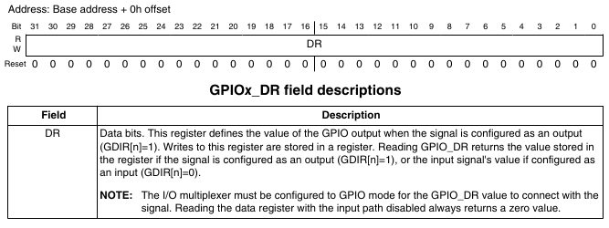

`GPIO` 是 **General-Purpose Input/Output**（通用输入输出）的缩写，是一种常见的硬件接口，用于微控制器、单板计算机（如树莓派）或其他嵌入式系统中。GPIO 引脚可以通过软件配置为输入或输出，用于与外部设备进行交互。

### GPIO 的功能

1. **输入模式**：
   
   - 读取外部信号，例如按钮状态、传感器数据等。

2. **输出模式**：
   
   - 控制外部设备，例如点亮 LED、驱动继电器等。

3. **双向通信**：
   
   - 某些 GPIO 引脚可以动态切换输入输出模式，实现双向通信。

### GPIO 的特点

- **灵活性**：可以通过编程配置为输入或输出。

- **低电平/高电平**：通常支持两种状态，低电平（0）和高电平（1）。

- **电压范围**：常见的电压范围是 3.3V 或 5V，具体取决于硬件

---

### GPIO驱动点亮LED灯原理

1. 在开发板原理图中可以找到LED灯的设备物理设备
   
   
   
   可以看到引脚的名字为`led0`。
   
   
   
   这里可以看到`led0`与`GPIO_3`连接

2. 查看`IMX6ULL`手册，`GPIO_3`引脚相关的寄存器有两个，分别是`SW_MUX_CTL_PAD_GPIO1_IO03 SW MUX Control Register (IOMUXC_SW_MUX_CTL_PAD_GPIO1_IO03)`和`SW_PAD_CTL_PAD_GPIO1_IO03 SW PAD Control Register (IOMUXC_SW_PAD_CTL_PAD_GPIO1_IO03)`
   
   
   
   
   
   
   
   在`IMX6ULL`中，所有的引脚都是有复用关系的，当我们想要操作某一个引脚来驱动设备的时候，必须要选择正确的复用关系。这里的`IOMUXC_SW_MUX_CTL_PAD_GPIO1_IO03`用于控制`GPIO`引脚的复用功能。根据文档的`MUX_MODE`栏指示，该寄存器应该设置为`ALT5`即`0101`；`IOMUXC_SW_PAD_CTL_PAD_GPIO1_IO03`寄存器则是用于控制引脚的电气信息。参见32章的overview有写（这里的pad是引脚的意思）
   
   
   
   > 关于`IMX6ULL`的引脚命名：命名形式就是“IOMUXC_SW_MUC_CTL_PAD_XX_XX”，后面的“XX_XX”就是 IO 命名，比如： GPIO1_IO01、 UART1_TX_DATA、 JTAG_MOD 等等。 I.MX6ULL 的 GPIO 并不像 STM32一样以 PA0~15 这样命名，他是根据某个 IO 所拥有的功能来命名的。比如我们一看到GPIO1_IO01 就知道这个肯定能做 GPIO，看到 UART1_TX_DATA 肯定就知道这个 IO 肯定能做为 UART1 的发送引脚。

3. 电气信息配置
   
   由上知，电气信息配置完全由修改寄存器`IOMUXC_SW_PAD_CTL_PAD_GPIO1_IO03`存储的信息完成。这里给出`GPIO`各个属性的功能
   
   
   
   - **HYS(bit16)**：对应图 8.1.4.2 中 HYS，用来使能迟滞比较器，当 IO 作为输入功能的时候有效，用于设置输入接收器的施密特触发器是否使能。如果需要对输入波形进行整形的话可以使能此位。此位为 0 的时候禁止迟滞比较器，为 1 的时候使能迟滞比较器。
   
   - **PUS(bit15:14)**：对应图 8.1.4.2 中的 PUS，用来设置上下拉电阻的，一共有四种选项可以选择
     
     
   
   - **PUE(bit13)**：图 8.1.4.2 没有给出来，当 IO 作为输入的时候，这个位用来设置 IO 使用上下拉还是状态保持器。当为 0 的时候使用状态保持器，当为 1 的时候使用上下拉。状态保持器在IO 作为输入的时候才有用，顾名思义，就是当外部电路断电以后此 IO 口可以保持住以前的状态。
   
   - **PKE(bit12)**：对应图 8.1.4.2 中的 PKE，此位用来使能或者禁止上下拉/状态保持器功能，为0 时禁止上下拉/状态保持器，为 1 时使能上下拉和状态保持器。
   
   - **ODE(bit11)**：对应图 8.1.4.2 中的 ODE，当 IO 作为输出的时候，此位用来禁止或者使能开路输出，此位为 0 的时候禁止开路输出，当此位为 1 的时候就使能开路输出功能。
   
   - **SPEED(bit7:6)**：对应图 8.1.4.2 中的 SPEED，当 IO 用作输出的时候，此位用来设置 IO 速度
     
     
   
   - **DSE(bit5:3)**：对应图 8.1.4.2 中的 DSE，当 IO 用作输出的时候用来设置 IO 的驱动能力，即引脚能够提供的电流大小。总共有 8 个可选选项，
     
     
   
   - **SRE(bit0)**：对应图 8.1.4.2 中的 SRE，设置压摆率，当此位为 0 的时候是低压摆率，当为 1的时候是高压摆率。
     
     > 压摆率：反映IO电平跳变所需要的时间，压摆率高则时间越小，从0到1的波形就越陡，反之则越平缓

4. `GPIO`功能寄存器
   
   上面完成的是一个引脚配置成`GPIO`引脚，至此我们的`GPIO_3`已经可以作为`GPIO`引脚使用了。根据手册28章，`GPIO`引脚有8个功能寄存器：
   
   
   
   
   
   - `DR`寄存器：用于暂存输出/输入`GPIO`引脚的寄存器。
     
     如果 **IOMUXC** 配置为 GPIO 模式，并且对应的 **GDIR（方向寄存器）** 位设置为输出模式（`GDIR[n] = 1`），则 GPIO_DR 寄存器中的值会被驱动到对应的 GPIO 引脚。
     
      如果 **GDIR** 位设置为输入模式（`GDIR[n] = 0`），则读取 GPIO_DR 寄存器会返回对应 GPIO 引脚的输入信号值。
     
     
     
     此寄存器是 32 位的，一个 `GPIO`组最大只有 32 个 IO，因此 DR 寄存器中的每个位都对应一个 `GPIO`。当 `GPIO`被配置为输出功能以后，向指定的位写入数据那么相应的 IO 就会输出相应的高低电平，比如要设置 `GPIO1_IO00`输出高电平，那么就应该设置 `GPIO1.DR=1`。
     
     本开发板的`GPIO`引脚就只有10个，所以只会用到低10位。
   
   - `GDIR`寄存器
     
     这是方向寄存器，用来设置某个 `GPIO` 的工作方向的，即输入/输出，`GDIR` 寄存器结构如图
     
     
     
     同样的，每个 IO 对应一个位，如果要设置 GPIO 为输入的话就设置相应的位为 0，如果要设置为输出的话就设置为 1。比如要设置 `GPIO1_IO00` 为输入，那么 `GPIO1.GDIR=0`
   
   - `PSR`寄存器
     
     这是一个只读寄存器，用于存储对应的输入值（高低电平）。同样的，`PSR` 寄存器也是一个 `GPIO` 对应一个位，读取相应的位即可获取对应的`GPIO`的状态，也就是 `GPIO` 的高低电平值。功能和输入状态下的 DR 寄存器一样。
     
     
   
   - `ICR1`和`ICR2`
     
     用于配置中断。`ICR1`负责管理低16位的`GPIO`引脚输入信号的中断。两个都是32位寄存器，每两位管理一个引脚的中断。
     
     
     
     
     
     上面分别是`ICR1`和`ICR2`的内容。每两位管理一个引脚的中断方式，共四种方式如下
     
     
   
   - `ISR`寄存器
     
     32位中断状态寄存器，一个 `GPIO` 对应一个位，只要某个 `GPIO` 的中断发生，那么
     `ISR` 中相应的位就会被置 1。可以通过读取 `ISR` 寄存器来判断 `GPIO` 中断是否发生，相当于 `ISR` 中的这些位就是中断标志位。当我们处理完中断以后，必须清除中断标志位，清除方法就是向 `ISR` 中相应的位写 1，也就是写 1 清零。
     
     
   
   - `EDGE_SEL`寄存器
     
     用来设置边沿中断，这个寄存器会覆盖 `ICR1` 和 `ICR2` 的设置，同样是一个 `GPIO` 对应一个位。如果相应的位被置 1，那么就相当与设置了对应的 `GPIO` 是上升沿和下降沿(双边沿)触发。例如，我们设置 `GPIO1.EDGE_SEL=1`，那么就表示 `GPIO1_IO01` 是双边沿触发中断，无论 `GFPIO1_ICR1` 的设置为多少，都是双边沿触发。
     
     

5. `GPIO`的时钟信号
   
   `GPIO`的使用必须要有时钟信号，不用的时候可以禁用节省电源。在手册18.4中，可以找到`GPIO`时钟的控制寄存器
   
   
   
   我们要使用的`GPIO1_IO3`应该是使用`CCGR1`来控制。同样在18.6.24中找到`CCM_CCGR1`小节，可以看到`GPIO1`的控制域
   
   
   
   
   
   `CCGR0`小节我们可以找到2 bit对应的功能
   
   
   
   为了启动`GPIO1`的时钟，我们可以将`CCM_CCGR1`的`CG13`直接设置为`11`

---

### GPIO驱动启动总结（大部分GPIO都是这么配置的）

1. 使能`GPIO`时钟，即通过设置`CCM_CCGR1`寄存器对应位置

2. 设置`IOMUXC_SW_MUX_CTL_PAD_GPIO1_IO3`寄存器，正确配置复用功能

3. 设置`IOMUXC_SW_PAD_CTL_PAD_GPIO1_IO3`寄存器，完成引脚电气属性配置

4. 设置`GPIO`八大寄存器（见上文）

---

### 硬件原理分析

从该图不难看出，当`LED0`处为高电平，小灯没有电流流过，就不会发光；反之，当`LED0`处为低电平，电流流过小灯，发出红色光。即：

- `GPIO1_IO3`为高电平1时，小灯灭

- `GPIO1_IO3`为低电平0时，小灯亮
