### ARMv7的异常处理（中断）

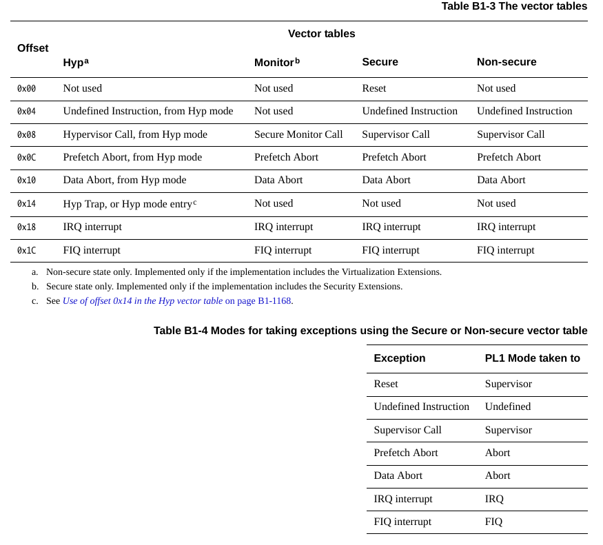

在ARMv7中所有的中断只有8个大类，其中外部设备的中断都在IRQ大类中。

### 通过CP15协处理器进行芯片复位

CP15寄存器是一组寄存器编号为C0~C15。每一个寄存器根据寄存器操作码（opc1和opc2）和CRm又可分为多个寄存器。这里我们给出c1标号的寄存器组，因为我们要用到其中的`SCTLR`来复位芯片

> 这里的复位和我们所谓的按复位键复位不是一个东西。按复位键是imx6ull复位，重置的寄存器都是imx6ull的寄存器，这里的复位是ARM架构层面的复位。只要是使用ARM架构的芯片都可以进行的复位操作。

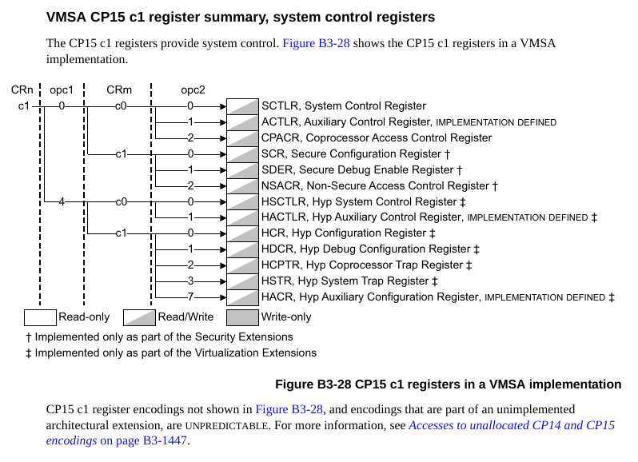

在ARM手册B4.1.130可以看到`SCTLR`寄存器的各个为定义

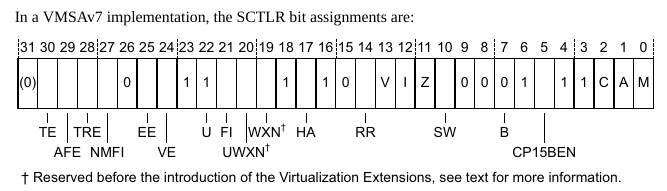

imx6ull官方的代码中，实现`Reset_Handler`时就用到了这个寄存器，禁用了mmu，指令cache，数据cache。

对CP15寄存器操作的时候，应该使用专用指令`mcr`和`mrc`

`MCR`（Move to Coprocessor from Register）：用于 **把通用寄存器的值写入到协处理器的寄存器**。

```asm
mcr pX, #<opcode1>, <Rt>, <CRn>, <CRm>, #<opcode2>
```

`MRC`（Move from Coprocessor to Register）：用于 **从协处理器的寄存器读取数据到通用寄存器**。

```asm
mrc pX, #<opcode1>, <Rt>, <CRn>, <CRm>, #<opcode2>
```

这里的`pX`表示协处理器编号，如果我们要操作CP15的寄存器，就是`p15`。下面我们给出复位操作要做的操作

- 禁用mmu，也就是将`M`位清零

- 禁用数据cache，也就是将`C`位清零

- 禁用指令cache，也就是将`I`位清零

- 禁用分支预测，也就是将`Z`位清零

- 关闭对齐检查，也就是将`A`位清零

- 设置中断向量表的位置为0x00000000，也就是设置`V`位为0

> 这里注意，我们将中断向量表设置到0x00000000并不是真的要把向量表放到这里，根据手册，这个地址是可以重新映射的
> 
> 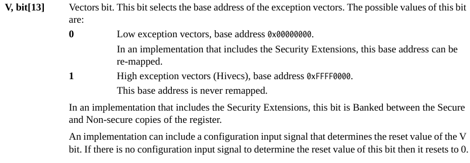
> 
> 在arm手册的B1.8.1中，我们可以看到这么一段
> 
> 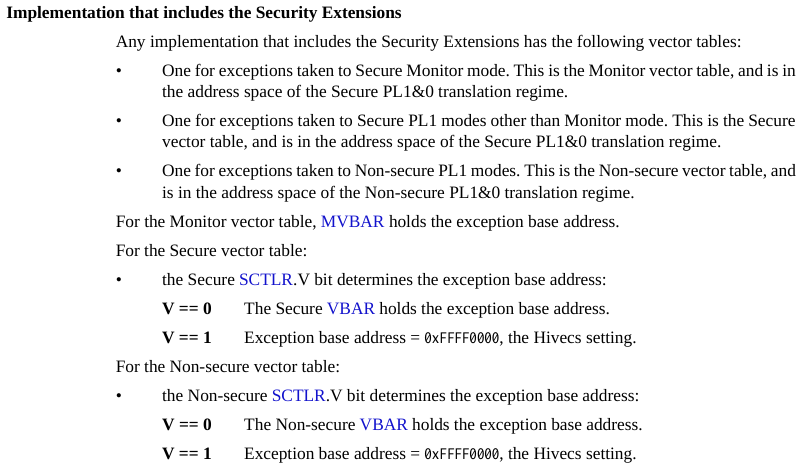
> 
> imx6ull是ARMv7-a架构，也就是支持Security Extensions的架构，那么在指定了`V`为0的时候，会去使用`VBAR`中的地址作为向量表的基地址。

至此我们就完成了复位中断的服务函数，函数中被关闭的功能，在后面要用到的时候会打开。

```asm
Reset_Handler:
    cpsid ; disable interrupts
    mrc p15, 0, r0, c1, c0, 0
    bic r0, r0, #0x7 ; clear C A M bits
    bic r0, r0, #0x3800 ; clear V, I, Z bits
    mcr p15, 0, r0, c1, c0, 0

    ldr r0, =0x80100000
    mcr p15, 0, r0, c12, c0, 0 ; write to VBAR

    ; set sp for IRQ mode
    mrs r0, cpsr
    bic r0, r0, #0x1F
    orr r0, r0, #0x12
    msr cpsr, r0
    ldr sp, =0x80020000

    ; set sp for SVC mode
    mrs r0, cpsr
    bic r0, r0, #0x1F
    orr r0, r0, #0x13
    msr cpsr, r0
    ldr sp, =0x80010000
    cpsie ; enable interrupts

    b main
```

---

### IRQ中断服务程序

相比之下，IRQ中断才是机器运行起来之后最常用的中断。对于不同的IRQ中断号，要分别跳转到不同的中断程序中。在学习IRQ中断之前首先要先了解GIC控制器。

GIC控制器起到一个接受中断源信号并将对应的中断种类和ID返回给CPU的作用

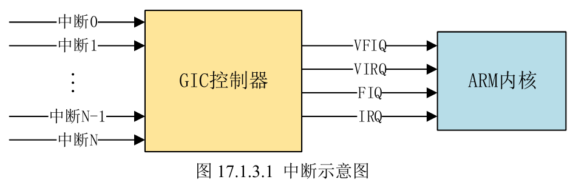

> 在x86架构上，异常（Exceptions，或者叫内部中断）分为：Fault，Abort和Trap，但在ARM中，不管是外部中断还是内部中断统统叫异常（Exceptions），并且进一步分为：Abort，Trap，Interrupt。没有Fault的概念，且Interrupt就是所谓的外部中断

GIC中断控制器是接受外部中断的控制器，返回给CPU的信号就是图中的VFIQ，VIRQ，FIQ，IRQ四种。在GIC手册的2.2.1中，可以看到ARM指定了1020个中断ID号用来给不同的中断源来分配。（具体怎么分配就看产商了）

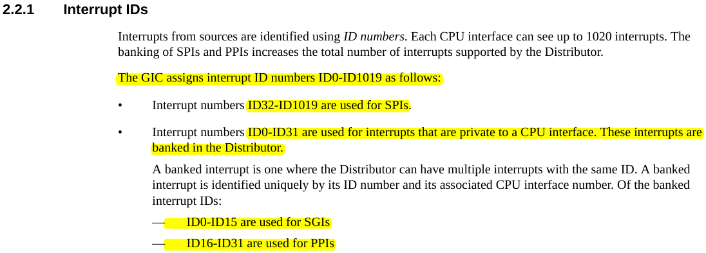

> - SPI：Shared Peripheral Interrupts，即共享中断，例如按键中断，串口中断等等这些常见的外部中断
> 
> - PPI：Private Peripheral Interrupts，即私有中断，GIC支持多核CPU，每个CPU可以有自己独有的中断，必须由拥有者自己处理
> 
> - SGI：Software-generated Interrupts，软件中断，由软件向`GICD_SGIR`写入数据来触发。

GIC是一个可编程控制器，可以通过操作寄存器来完成对应的功能操作，在Technical reference的8.2.1中可以找到GIC寄存器的地址映射（或者在GIC手册的4.1.3中也有地址映射记载）

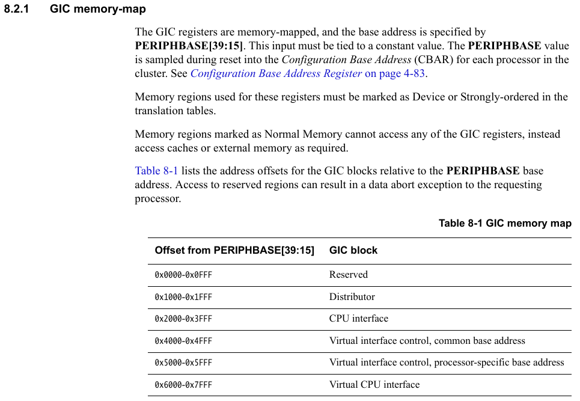

这里我们找到位于CPU interface的`GICC_IAR`寄存器，这个寄存器用于获取中断ID号

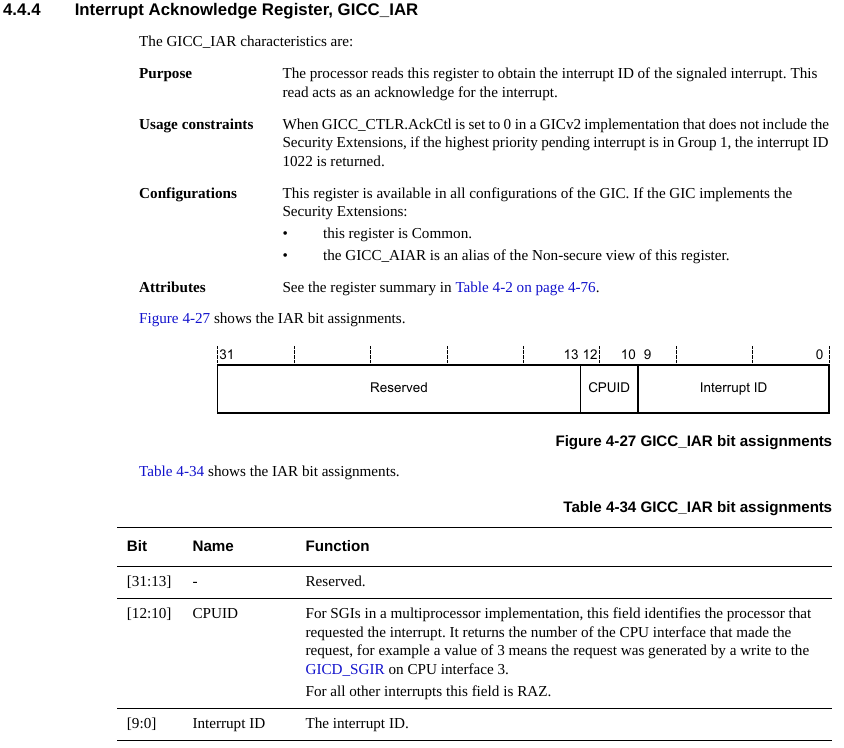

读取其中的低10位即为对应的中断ID。另外，当GIC通知CPU有IRQ中断信号的时候，CPU会自动进行状态转换，见ARM手册B1.8.4。在支持Security extensions，`SRC`寄存器复位全0条件下，CPU会自动进入IRQ模式

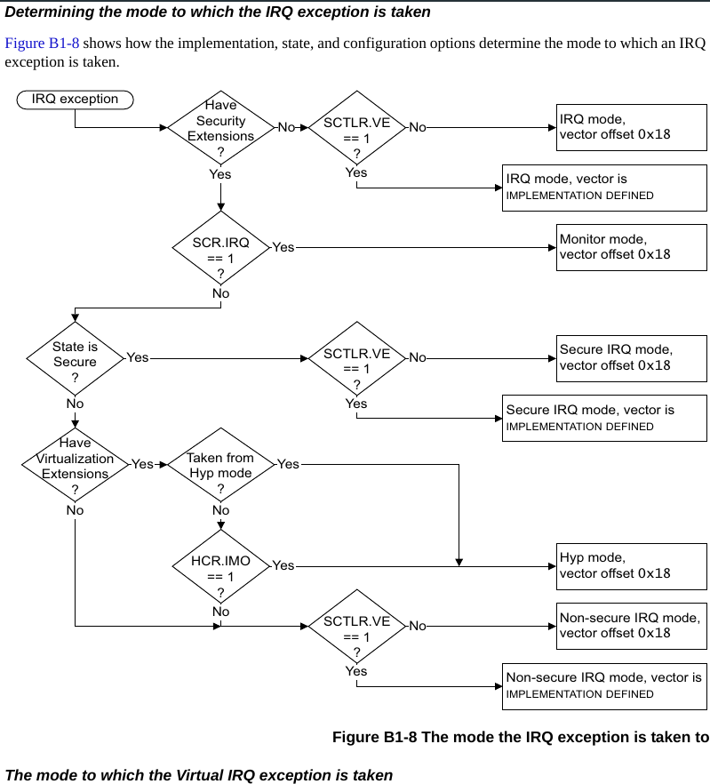

另外，当CPU进入IRQ模式的时候，`CPSR`寄存器中的中断允许位会被设置为1禁用。在ARM手册B1.8.4中可以找到相关的内容：当异常发生的时候，CPU为了处理异常，一定会转换到1级特权态（或者更高级的状态）

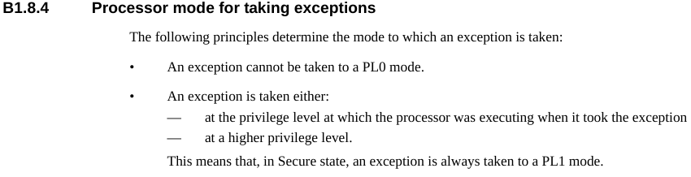

下面的图片给出了对应异常会转换到的特权态，处理IRQ中断的时候，CPU会转换到IRQ状态。

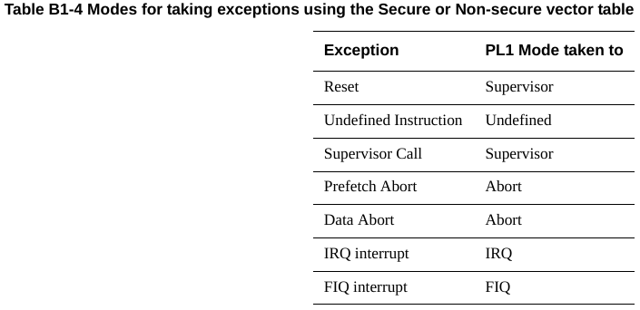

此外，在异常发生的时候，CPU的状态信息会自动从`CPSR`保存到`SPSR`中（即异常发生前的`CPSR`）在手册的B1.3.3中，可以看到`SPSR`在异常发生的行为，即自动保存`CPSR`

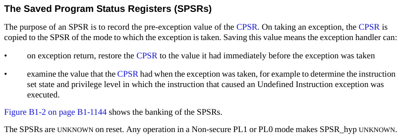

在技术手册的4.2.16可以找到`c15`寄存器组的`CBAR`寄存器，这里存放了GIC寄存器的基地址。

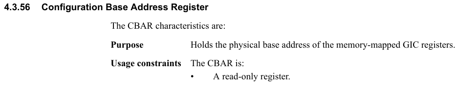

imx6ull手册上第三章给出了nxp定义的128个中断号分配表。这128个中断源发出的中断信号会通过GIC变成对应的四种信号之一送入到内核中。

总结要干的事情：

1. 保存寄存器

2. 从GIC控制器的`GICC_IAR`中取出对应的中断号

3. 加载到对应的处理函数入口，并从IRQ转换到SVC，以便可以继续中断

4. 代码完成后，转换回IRQ模式，恢复寄存器

5. 在`GICC_EOIR`置位通知GIC处理完毕
   
   > 置位其实就是直接把ID写到`GICC_EOIR`
   > 
   > 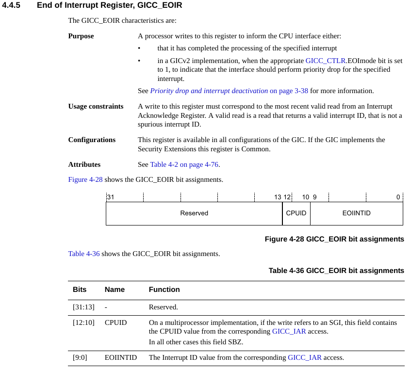

6. 回到原来执行代码的地方

> ARM手册的3.2节中有相关的内容
> 
> 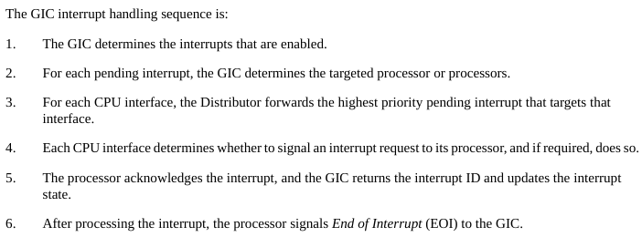

```asm
IRQ_Handler: ; CPU will be taken to IRQ mode automatically
    push {lr}
    push {r0-r3, r12}

    mrs r0, spsr ; CPSR has been saved in SPSR_irq automatically
    push {r0} ; save SPSR

    mrc p15, 4, r1, c15, c0, 0; Read Configuration Base Address Register(GIC Base Address)
    add r1, r1, #0x2000 ; CPU Interface Control Register Base Address
    ldr r0, [r1, #0xC] ; Read the Interrupt Acknowledge Register(GICC_IAR)
    and r0, r0, #0x3FF ; Get the interrupt ID

    push {r0, r1}
    cps #0x13 ; change to SVC mode
    push {lr}
    bl =_system_irq_handler_

    pop {lr}
    cps #0x12 ; change to IRQ mode
    pop {r0, r1}
    str r0, [r1, #0x10] ; Write the End of Interrupt Register(GICC_EOIR)

    pop {r0}
    msr spsr, r0

    pop {r0-r3, r12}
    pop {lr}
    subs pc, lr, #4 ; return to next instruction
```

（要素过多）
