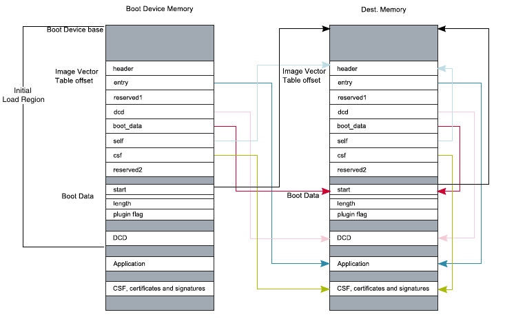
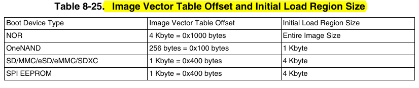
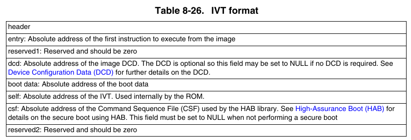
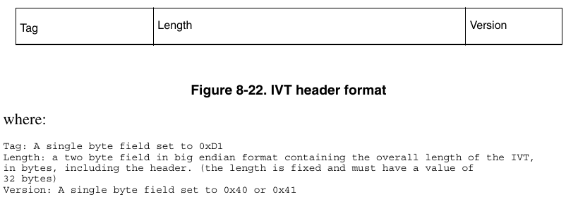
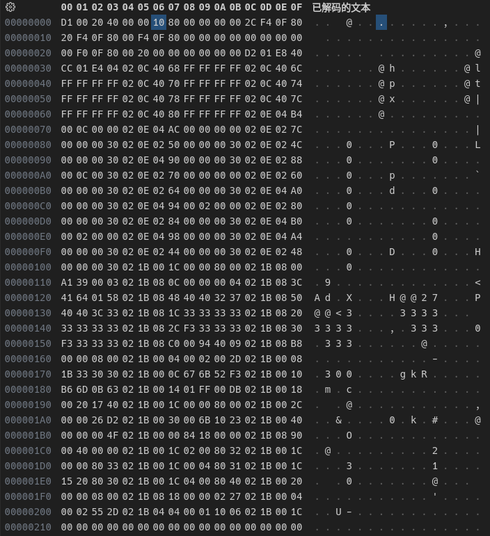
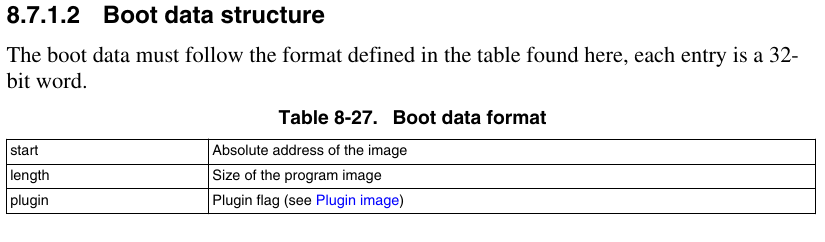
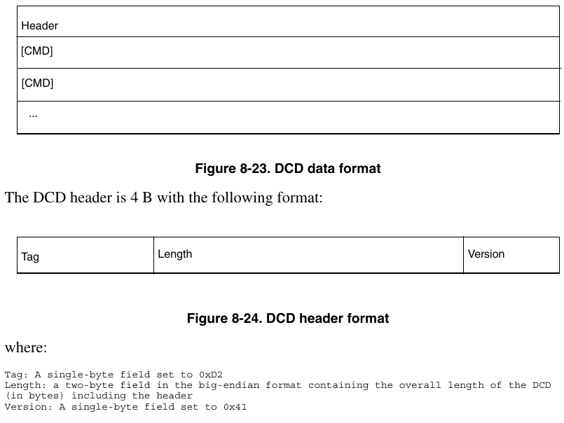
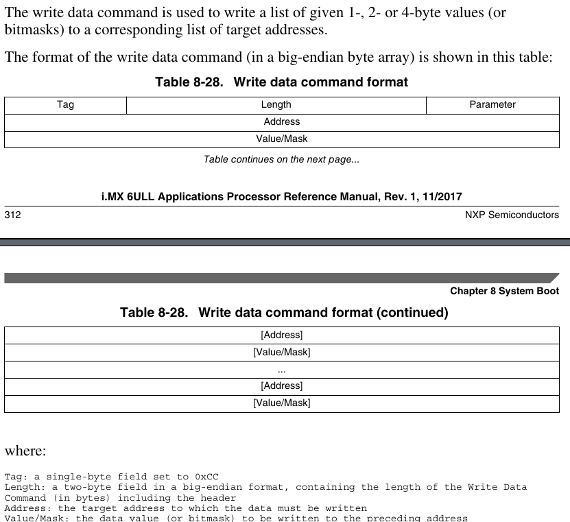

### 程序镜像Program image与初始化加载区域Initial Load Region

写好的逻辑驱动程序首先要编译成`.bin`的格式才能被裸机运行，但就算这样也还是不能直接烧录进存储介质用于开发板启动。

> 这里提一嘴`.elf`和`.bin`的区别，两者虽然都是可执行的二进制文件，但是`.elf`是标准的可执行文件格式，包含多个段（如代码段、数据段、符号表、重定位表等）；而`.bin`则是纯二进制数据，这两者完全不是一个东西。
> 
> | 特性       | bin 文件       | ELF 文件        |
> | -------- | ------------ | ------------- |
> | **文件结构** | 简单，纯二进制数据    | 复杂，包含多个段和元数据  |
> | **元数据**  | 无            | 包含符号表、调试信息等   |
> | **动态链接** | 不支持          | 支持            |
> | **重定位**  | 不支持          | 支持            |
> | **适用场景** | 嵌入式系统、引导加载程序 | 现代操作系统、应用程序   |
> | **加载方式** | 直接加载到内存的特定地址 | 通过加载器解析并加载到内存 |

根据之前编写驱动程序的过程，我们知道在`.bin`文件前面还要加上一个头部组成`.imx`文件才行。这个头部就是初始化加载区域Initial Load Region

图中左半部分是`.imx`在存储介质中，右半部分是`.imx`加载到内存中。由图知，Initial Load Region包含三个部分：IVT（Image Vector Table），Boot data，DCD（Device Configure Data），注意这三者之间是没有间隙的，不要被图片误导了。

至于为什么IVT不是顶着Boot Device base写的，这是因为不同的存储介质头部要保留一部分格式化信息。参见下表

这里我们如果是SD卡启动，则应该在烧写时空出1KB的位置再开始写`.imx`文件的内容。这也是为什么我们在makefile要先dd出1KB的全0出来再导出`.img`镜像文件。

> 但是如果是用`uuu`下载的，就只要考虑`.imx`文件的头部就可以了。

### IVT

IVT一共是32B，8个字段，每个字段32位。

除了第一个`header`，其他部分存的都是32位地址。

虽然前面说Initial Load Region大小有4KB，但是实际上IVT+Boot data+DCD的内容并不多，大部分都是0，这里我们截取了前半部分

根据上面的解释，第一个32位为`D1002040`，指明IVT大小（包括头部）共32B。后面的`00001080`指明了`entry`即程序入口地址为`0x80100000`，也就是图中Application的首地址。

### Boot data

一共12B，每个字段4B，共3个字段

要指出的是，`start`字段的值为`800FF000`，这个值的计算是这样的：

$$
80100000H-1000H=800FF000
$$

其实就是Application首地址减掉了4KB（Initial Load Region的大小）。而`length`字段指出的是镜像的大小。

### DCD

复位以后，`I.MX6ULL` 片内的所有寄存器都会复位为默认值，但是这些默认值往往不是想要的值（例如DDR内存相关的寄存器），而且有些外设我们必须在使用之前初始化它。为此提出了`DCD`(Device Config Data)的概念，和 `IVT`、`Boot Data` 一样，`DCD` 也是添加到 `load.imx` 里面的，紧跟在 `IVT` 和 `Boot Data` 后面，`IVT` 里面也指定了 `DCD` 的位置。`DCD` 其实就是 `I.MX6ULL` 寄存器地址和对应的配置信息集合，`Boot ROM` 会使用这些寄存器地址和配置集合来初始化相应的寄存器，比如开启某些外设的时钟、初始化 DDR 等等。`DCD` 区域不能超过 1768Byte

`DCD`由头部和若干条命令组成

头部指出了`DCD`长度大小。指令则包含4种（见手册第8章）

- 写数据指令（主要）
  
  

- 检查数据指令

- 空指令

- 解锁指令
