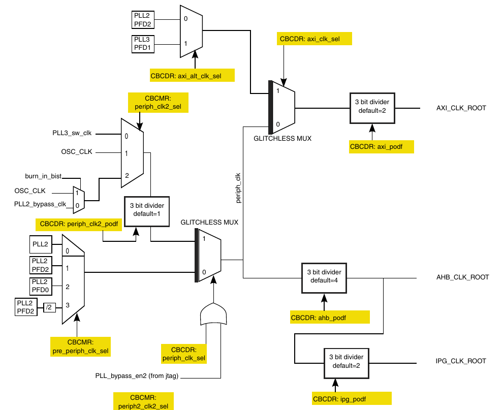
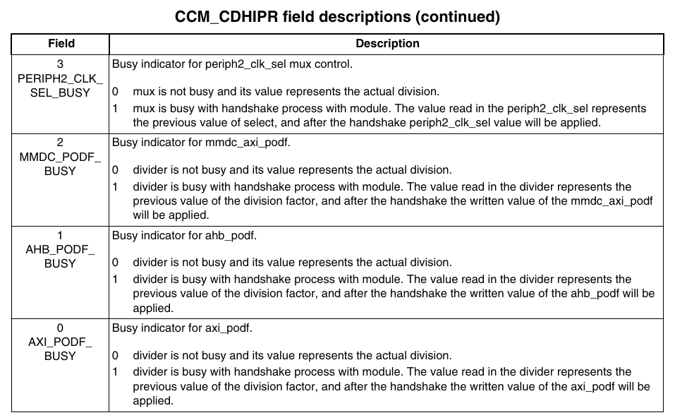

### 各个时钟线信号的默认值，最大值


注意这里都是以`ROOT`结尾的信号

### 时钟树


### 设置AHB时钟



- 设置`CBCMR`的`pre_periph_clk_sel`字段为1，选择PLL2的PFD2作为时钟源

- 设置`CBCDR`的`periph_clk_sel`为0

- 设置`CBCDR`的`ahb_podf`为3分频
  
  要等待`CDHIPR`忙信号
  
  
  
  
  
  在`CDHIPR`只读寄存器的对应位置上可以读到握手状态。在写程序的时候，要等到忙信号结束后，在执行其他的操作，确保握手能顺利进行。
  
  

```c
void AHB_CLK_ROOT_Init()
{
    uint32_t tmp_reg = CCM->CBCDR;
    tmp_reg &= ~(CCM_CBCMR_PRE_PERIPH_CLK_SEL_MASK);
    tmp_reg |= CCM_CBCMR_PRE_PERIPH_CLK_SEL(1);
    CCM->CBCDR = tmp_reg; //设置pre_periph_clk为pll2_pfd2

    tmp_reg = CCM->CBCDR;
    tmp_reg &= ~(CCM_CBCDR_PERIPH_CLK_SEL_MASK);
    tmp_reg |= CCM_CBCDR_PERIPH_CLK_SEL(0);
    tmp_reg &= ~(CCM_CBCDR_AHB_PODF_MASK);
    tmp_reg |= CCM_CBCDR_AHB_PODF(3);
    CCM->CBCDR = tmp_reg; //设置periph_clk为pre_periph_clk/3
    while(CCM->CDHIPR & CCM_CDHIPR_AHB_PODF_BUSY_MASK);//等待设置完成
}
```

### 设置IPG时钟

在上一步的基础上，设置`CBCDR`的`ipg_podf`为2分频

```c
void IPG_CLK_ROOT_Init()
{
    uint32_t tmp_reg = CCM->CBCDR;
    tmp_reg &= ~(CCM_CBCDR_IPG_PODF_MASK);
    tmp_reg |= CCM_CBCDR_IPG_PODF(1);
    CCM->CBCDR = tmp_reg; //设置ipg_clk为ahb_clk_root/2
}
```

### 设置PERCLK时钟

在上一步的基础上设置`CSCMR1`的`perclk_podf`为2分频

```c
void PERCLK_CLK_ROOT_Init()
{
    uint32_t tmp_reg = CCM->CSCMR1;
    tmp_reg &= ~(CCM_CSCMR1_PERCLK_PODF_MASK);
    tmp_reg |= CCM_CSCMR1_PERCLK_PODF(1);
    CCM->CSCMR1 = tmp_reg; //设置perclk_clk为ahb_clk_root/2
}
```

### ARM PLL的时钟设置

注意ARM PLL的时钟频率和实际的内核频率不是一个东西，前者是pll1_sw_clk上的信号，后者是ARM核心实际运行的频率。从时钟树可以看出ARM PLL和核心频率差一个`ARM_PODF`的分频。后面那个灰色的分频是固定分频不可变（或者理解成`pll1_sw_clk`信号就是从固定分频那个地方出来的）


在ARM PLL的小节中我们可以找到PLL输出频率的计算方式


也就是说，设置ARM PLL的频率只需要修改`CCM_ANALOG_PLL_ARM`的`DIV_SELECT`字段就好了（这里的除2对应于前面说到的那个灰色的2分频）

另外要注意，在配置PLL的时候，应该要将连接到这个PLL的所有下游时钟信号配置到一个新的稳定时钟上，配置PLL完成后再切换回来。


为了实现上面的替换功能，可以使用两种方式，一是用switcher来实现，即操作`CCM_CCSR`将`pll1_sw_clk`的源替换为`osc24m`；二是用bypass的方式，在`CCM_ANALOG_PLL_ARM`寄存器中配置`BYPASS`字段将ARM PLL配置到`osc24m`源。（其实都一样，反正就是暂时配置到晶振时钟上）

```c
void ARM_PLL_Init(uint32_t outfreq)
{
    // if(outfreq < 600 || outfreq > 1300){
    //     return;
    // }
    uint32_t div_sel = (uint32_t)(outfreq * 2 / OSC24M);
    if(CCM->CCSR & (CCM_CCSR_PLL1_SW_CLK_SEL_MASK) == 0){
        CCM->CCSR &= ~(CCM_CCSR_STEP_SEL_MASK);    //set step_clk to osc24m
        CCM->CCSR |= CCM_CCSR_PLL1_SW_CLK_SEL_MASK; //set pll1_sw_clk to step_clk
    }
    uint32_t reg = CCM_ANALOG->PLL_ARM;
    reg &= ~(CCM_ANALOG_PLL_ARM_DIV_SELECT_MASK);
    reg |= CCM_ANALOG_PLL_ARM_DIV_SELECT(div_sel);
    CCM_ANALOG->PLL_ARM = reg;
    CCM->CACRR = 0x1; 
    while(CCM->CDHIPR & CCM_CDHIPR_ARM_PODF_BUSY_MASK);

    CCM->CCSR |= CCM_CCSR_STEP_SEL_MASK; //set step_clk to secondary_clk
    CCM->CCSR &= ~(CCM_CCSR_PLL1_SW_CLK_SEL_MASK); // set pll1_sw_clk to pll1_main_clk
}
```

### USB1 PLL和System PLL的配置

这两个PLL的频率是固定的（虽然也可以修改对应寄存器的`DIV_SELECT`，但是应该始终将这两个PLL配置到固定的频率上）。这里我们只需要初始化这两个PLL对应的PFD即可

```c
void System_PLL_Init() //只需要设置pfd即可
{
    uint32_t reg = CCM_ANALOG->PFD_528;
    reg &= ~(CCM_ANALOG_PFD_528_PFD0_FRAC_MASK | CCM_ANALOG_PFD_528_PFD1_FRAC_MASK | CCM_ANALOG_PFD_528_PFD2_FRAC_MASK | CCM_ANALOG_PFD_528_PFD3_FRAC_MASK);//对应位置清零
    reg |= CCM_ANALOG_PFD_528_PFD0_FRAC(27) | CCM_ANALOG_PFD_528_PFD1_FRAC(16) | CCM_ANALOG_PFD_528_PFD2_FRAC(24) | CCM_ANALOG_PFD_528_PFD3_FRAC(32);//设置对应frac值
    CCM_ANALOG->PFD_528 = reg;
}

void USB1_PLL_Init() //只需要设置pfd即可
{
    uint32_t reg = CCM_ANALOG->PFD_480;
    reg &= ~(CCM_ANALOG_PFD_480_PFD0_FRAC_MASK | CCM_ANALOG_PFD_480_PFD1_FRAC_MASK | CCM_ANALOG_PFD_480_PFD2_FRAC_MASK | CCM_ANALOG_PFD_480_PFD3_FRAC_MASK);
    reg |= CCM_ANALOG_PFD_480_PFD0_FRAC(19) | CCM_ANALOG_PFD_480_PFD1_FRAC(17) | CCM_ANALOG_PFD_480_PFD2_FRAC(16) | CCM_ANALOG_PFD_480_PFD3_FRAC(12);
    CCM_ANALOG->PFD_480 = reg;
}
```
