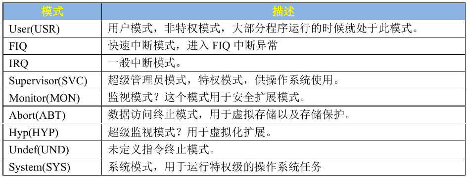
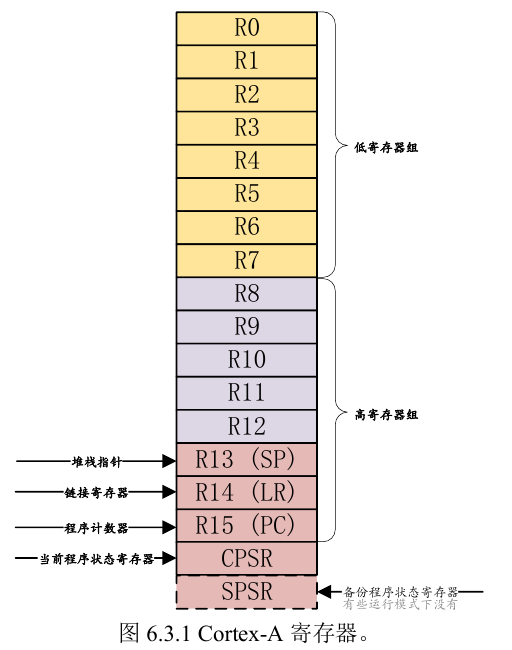
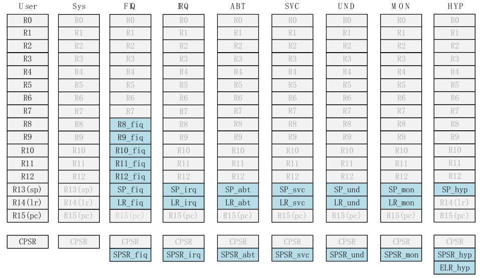
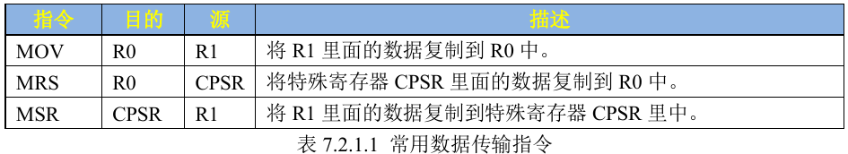
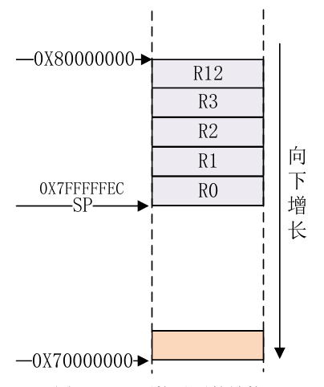
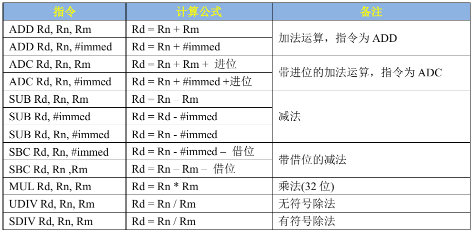
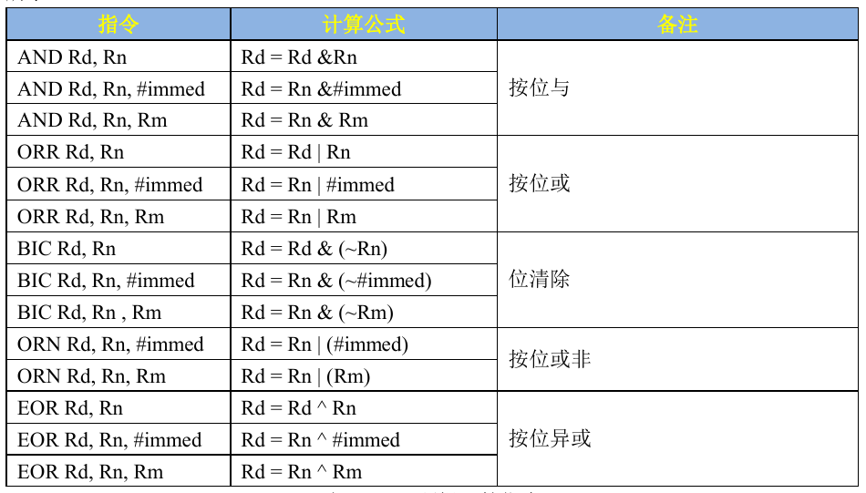

### 关于ARM

`Cortex-A`系列的芯片一上电其实`SP`指针并没有初始化，不具备`C`环境的运行条件。必须要用汇编语言提前设置好`C`程序运行的条件才能执行后面的程序。

### GNU汇编语法

```asm
label: instrcution @comment
```

- **label 即标号**，表示地址位置，有些指令前面可能会有标号，这样就可以通过这个标号得到指令的地址，标号也可以用来表示数据地址。注意 label 后面的`:`，任何以`:`结尾的标识符都会被识别为一个标号。

- **instruction 即指令**，也就是汇编指令或伪指令。

- @符号，表示后面的是注释，其实在 GNU 汇编文件中我们也可以使用`/*`和`*/`来注释。comment 就是注释内容。

> 注意：ARM 中的指令、伪指令、伪操作、寄存器名等可以全部使用大写，也可以全部使用小写，但是不能大小写混用例如
> 
> ```asm
> MOV r0, #1  ; 如果汇编器要求小写，则会导致错误
> ```

### 汇编程序的入口

与C语言类似，C语言总是以`main()`作为默认的入口函数，而汇编程序（一般是裸机程序）的入口函数通常是`_start`或者`start`

```asm
.global _start
_start:
    b main  ; 跳转到主函数
```

### 伪操作

**伪操作**（Pseudo-Operation，简称 **伪指令** 或 **伪操作符**）是一些特殊的指令，它们并不是真正的机器指令，而是由 **汇编器** 提供的辅助功能，用于帮助程序员更方便地编写和管理汇编代码。伪操作不会直接生成机器代码，而是在汇编过程中被处理，用于控制汇编器的行为或生成特定的数据。

### **伪操作的作用**

1. **定义数据**：用于定义常量、变量或初始化内存区域。例如
   
   - `.byte/DB`:定义一个或多个字节数据
   
   - `.word/DW`:定义一个或多个字
   
   - `.asciz/.string`:定义以`\0`结尾的字符串
   
   - `.space/.skip`:定义指定大小的未初始化内存空间

2. 控制汇编器的行为，如条件汇编、宏定义等。条件汇编用于根据条件选择性地汇编代码。
   
   - **.if / .else / .endif**：条件汇编
   
   - **.macro/.endm:** 用于定义和展开宏

3. **简化代码**：提供更高级的语法功能，简化代码编写。

4. **管理符号和地址**：用于定义符号、分配地址空间等。
   
   - **.equ/.set:** 定义符号常量
   
   - **.global/.globl:** 声明全局符号

5. **段定义：** 用户可以使用`.section` 伪操作来定义一个段，汇编系统预定义了一些段名：
   
   - `.text`表示代码段
   
   - `.data`表示初始化的数据段
   
   - `.bss`表示未初始化的数据段
   
   - `.rodata`表示只读数据段

### ARM处理器的运行

以前的 ARM 处理器（`Cortex-A` 系列）有 7 中运行模型：`User`、`FIQ`、`IRQ`、`Supervisor(SVC)`、`Abort`、`Undef`和 `System`，其中 `User` 是非特权模式，其余 6 中都是特权模式。但新的 Cortex-A 架构加入了TrustZone 安全扩展，所以就新加了一种运行模式：`Monitor`，新的处理器架构还支持虚拟化扩展，因此又加入了另一个运行模式：`Hyp`，所以 Cortex-A7 处理器有 9 种处理模式



除了 `User`用户模式以外，其它 8 种运行模式都是特权模式。这几个运行模式<u>可以通过软件进行任意切换，也可以通过中断或者异常来进行切换</u>。大多数的程序都运行在用户模式，用户模式下是不能访问系统所有资源的，有些资源是受限的，要想访问这些受限的资源就必须进行模式切换。但是**用户模式是不能直接进行切换的，用户模式下需要借助异常来完成模式切换**（就是`trap`），当要切换模式的时候，应用程序可以产生异常，在异常的处理过程中完成处理器模式切换。

### ARM处理器的寄存器管理



其中`r0`到`r12`都是一般寄存器即general purpose register。前8个寄存器又称为低寄存器组，它们在各个模式下都是是共用的，后面的寄存器则不一定。



上图中蓝色的方框表示的是在该模式下会使用的特殊寄存器。

通用寄存器中，又进一步分为三类寄存器：

- 未备份寄存器：`r0`到`r7`这8个寄存器，所有模式都要共用的寄存器。

- 备份寄存器：`r8`到`r12`这8个寄存器。每个寄存器`rx`都实际上对应多个物理寄存器。
  
  > 其中`r14`寄存器也叫做连接寄存器，连接寄存器有两个用途：保存当前子程序调用的返回地址；保存异常发生处理时的返回地址。

- 程序计数器：`r15`也就是程序计数器

### ARM程序的函数调用

在 **ARM 汇编** 中，函数的定义和调用遵循一定的规则和约定，主要包括 **函数入口和出口的处理**、**寄存器的使用** 以及 **参数传递** 等。以下是 ARM 汇编中定义函数的详细步骤和示例：

---

### **1. 函数定义的基本结构**

在 ARM 汇编中，函数通常包括以下部分：

1. **函数标签**：标记函数的入口点。
2. **函数体**：实现函数功能的汇编代码。
3. **函数返回**：使用 `bx lr` 或 `mov pc, lr` 返回到调用者。

---

### **2. 寄存器的使用约定**

ARM 汇编遵循 **ARM 过程调用标准（AAPCS）**，规定了寄存器的使用规则：

- **r0-r3**：用于传递函数参数（前 4 个参数）。
- **r4-r11**：用于保存局部变量，需要在函数中使用时保存和恢复。
- **r12 (IP)**：临时寄存器。
- **r13 (SP)**：栈指针，指向当前栈顶。
- **r14 (LR)**：链接寄存器，保存返回地址。
- **r15 (PC)**：程序计数器，指向当前执行的指令。

---

### **3. 函数定义示例**

以下是一个简单的 ARM 汇编函数示例，实现两个整数相加的功能：

```asm
.global add_two_numbers  ; 声明函数为全局符号

add_two_numbers:
    // 函数入口
    push {r4, lr}        // 保存 r4 和 lr（如果需要使用 r4）

    // 函数体
    add r0, r0, r1       // r0 = r0 + r1（参数通过 r0 和 r1 传递）

    // 函数返回
    pop {r4, lr}         // 恢复 r4 和 lr
    bx lr                // 返回到调用者
```

---

### **4. 函数调用示例**

调用上述 `add_two_numbers` 函数的示例：

```asm
.global main

main:
    // 设置参数
    mov r0, #5           // 第一个参数：5
    mov r1, #10          // 第二个参数：10

    // 调用函数
    bl add_two_numbers   // 调用 add_two_numbers，返回地址保存在 lr

    // 结果在 r0 中
    // 可以继续使用 r0 中的结果

    // 程序结束
    mov r7, #1           // 系统调用号：退出
    swi 0                // 执行系统调用
```

---

### **5. 函数定义的详细步骤**

#### **(1) 函数入口**

- 保存需要使用的寄存器（如 `r4-r11` 和 `lr`）。

- 使用 `push` 指令将寄存器压栈：
  
  ```asm
  push {r4, lr}  // 保存 r4 和 lr
  ```

#### **(2) 函数体**

- 实现函数的具体功能。
- 参数通过 `r0-r3` 传递，返回值通过 `r0` 返回。

#### **(3) 函数返回**

- 恢复保存的寄存器。

- 使用 `bx lr` 或 `mov pc, lr` 返回到调用者：
  
  ```asm
  pop {r4, lr}  // 恢复 r4 和 lr
  bx lr         // 返回到调用者
  ```

---

### **6. 参数传递和返回值**

- **参数传递**：
  - 前 4 个参数通过 `r0-r3` 传递。
  - 如果参数超过 4 个，多余的参数通过栈传递。
- **返回值**：
  - 返回值通过 `r0` 传递。

#### **示例：传递多个参数**

```asm
.global my_function

my_function:
    push {r4, lr}        // 保存寄存器

    ldr r4, [sp, #8]     // 从栈中加载第 5 个参数（假设栈中有参数）

    // 函数体
    add r0, r0, r1       // r0 = r0 + r1
    add r0, r0, r2       // r0 = r0 + r2
    add r0, r0, r3       // r0 = r0 + r3
    add r0, r0, r4       // r0 = r0 + r4（第 5 个参数）

    pop {r4, lr}         // 恢复寄存器
    bx lr                // 返回
```

---

### **7. 栈的使用**

- 如果函数需要使用额外的寄存器或局部变量，可以通过栈来保存和恢复寄存器。
- 使用 `push` 和 `pop` 指令操作栈。

---

### ARM数据传输指令



##### `mov`指令

```asm
mov r0, r1 @将r1的数据送入r0
mov r0, #0x12 @将立即数0x12送入r0
```

##### `MRS`指令

读取状态寄存器必须要用这个指令

```asm
mrs r0, cpsr @将状态寄存器cpsr的数据读到r0中
```

##### `msr`指令

向状态寄存器中写入

```asm
msr cspr, r0
```

### 访存指令

##### `ldr`指令

```asm
ldr r0, =0x0209c004 @将立即数0x0209c004载入r0
ldr r1, [r0] @将r0存储的地址的对应位置的内容载入到r1
```

##### `str`指令

```asm
str r1, [r0] @将r1地址存储的内容存到r0保存的地址中
```

### 堆栈操作指令

`push`和`pop`指令可以便捷得压入几个连续的寄存器

```asm
PUSH {R0~R3, R12} @将 R0~R3 和 R12 压栈
POP {R0~R3,R12} @再恢复 R0~R3,R12
```



 `PUSH` 和 `POP` 的另外一种写法是`STMFD SP!`和`LDMFD SP!`。`STMFD` 可以分为两部分：`STM`和 `FD`，同理，`LDMFD` 也可以分为 `LDM` 和 `FD`。FD 是 Full Descending 的缩写，即满递减的意思。根据 ATPCS 规则,ARM 使用的 FD 类型的堆栈，SP 指向最后一个入栈的数值，堆栈是由高地址向下增长的，也就是前面说的向下增长的堆栈，因此最常用的指令就是 STMFD 和 LDMFD。STM 和 LDM 的指令寄存器列表中编号小的对应低地址，编号高的对应高地址。

```asm
STMFD SP!,{R0~R3, R12} @R0~R3,R12 入栈
STMFD SP!,{LR} @LR 入栈

LDMFD SP!, {LR} @先恢复 LR
LDMFD SP!, {R0~R3, R12} @再恢复 R0~R3, R12
```

这里的`SP!`表示出栈/入栈时更新栈地址`SP`，每出/入一个元素，`SP`就移动一次。

### 跳转指令

在 **ARM 汇编** 中，**跳转指令** 用于控制程序的执行流程，实现分支、循环和函数调用等功能。ARM 汇编提供了多种跳转指令，主要包括 **无条件跳转**、**条件跳转** 和 **函数调用** 等。以下是常见的跳转指令及其用法：

---

### **1. 无条件跳转**

#### **(1) B（Branch）**

- **功能**：无条件跳转到指定的标签或地址。

- **语法**：
  
  ```asm
  B <label>
  ```

- **示例**：
  
  ```asm
  b loop  ; 跳转到标签 loop
  ```

#### **(2) BX（Branch and Exchange）**

- **功能**：跳转到指定寄存器中的地址，并根据目标地址的最低位切换指令集模式（ARM 或 Thumb）。

- **语法**：
  
  ```asm
  BX <Rn>
  ```

- **示例**：
  
  ```asm
  bx lr  ; 跳转到 lr 中的地址，通常用于函数返回
  ```

> 关于指令集模式：arm指令集实际上支持两种模式即arm指令集模式和thumb指令集模式，arm指令都是32位的，但是thumb指令模式可以使用16位和32位指令，综合两者可以更好提高指令密度。
> 
> 至于为什么最低位为1时会切换到thumb,为0时切换为arm,是因为pc以2B计数，当末尾出现1的时候则必然对应位置应该是存放thumb指令的。

#### **(3) BLX（Branch with Link and Exchange）**

- **功能**：跳转到指定寄存器中的地址，并将返回地址保存到 `lr` 寄存器中，同时根据目标地址的最低位切换指令集模式。

- **语法**：
  
  ```asm
  BLX <Rn>
  ```

- **示例**：
  
  ```asm
  blx r0  ; 跳转到 r0 中的地址，并将返回地址保存到 lr
  ```

---

### **2. 条件跳转**

ARM 汇编中的条件跳转指令基于 **条件码**（Condition Code），根据 CPSR 中的条件标志位（如 N、Z、C、V）决定是否跳转。

#### **(1) BEQ（Branch if Equal）**

- **功能**：如果 Z 标志位为 1（结果为零），则跳转。

- **语法**：
  
  ```asm
  BEQ <label>
  ```

- **示例**：
  
  ```asm
  cmp r0, #0  ; 比较 r0 和 0
  beq zero    ; 如果 r0 == 0，跳转到标签 zero
  ```

#### **(2) BNE（Branch if Not Equal）**

- **功能**：如果 Z 标志位为 0（结果不为零），则跳转。

- **语法**：
  
  ```asm
  BNE <label>
  ```

- **示例**：
  
  ```asm
  cmp r0, #0  ; 比较 r0 和 0
  bne not_zero ; 如果 r0 != 0，跳转到标签 not_zero
  ```

#### **(3) BGT（Branch if Greater Than）**

- **功能**：如果结果大于零（N == V），则跳转。

- **语法**：
  
  ```asm
  BGT <label>
  ```

- **示例**：
  
  ```asm
  cmp r0, r1  ; 比较 r0 和 r1
  bgt greater ; 如果 r0 > r1，跳转到标签 greater
  ```

#### **(4) BLT（Branch if Less Than）**

- **功能**：如果结果小于零（N != V），则跳转。

- **语法**：
  
  ```asm
  BLT <label>
  ```

- **示例**：
  
  ```asm
  cmp r0, r1  ; 比较 r0 和 r1
  blt less    ; 如果 r0 < r1，跳转到标签 less
  ```

#### **(5) 其他条件跳转指令**

- **BGE**：Branch if Greater Than or Equal（大于或等于）。
- **BLE**：Branch if Less Than or Equal（小于或等于）。
- **BHI**：Branch if Higher（无符号数大于）。
- **BLO**：Branch if Lower（无符号数小于）。

---

### **3. 函数调用**

#### **(1) BL（Branch with Link）**

- **功能**：跳转到指定的标签或地址，并将返回地址保存到 `lr` 寄存器中。

- **语法**：
  
  ```asm
  BL <label>
  ```

- **示例**：
  
  ```asm
  bl my_function  ; 调用 my_function，并将返回地址保存到 lr
  ```

#### **(2) BX LR**

- **功能**：跳转到 `lr` 寄存器中的地址，通常用于函数返回。

- **语法**：
  
  ```asm
  BX LR
  ```

- **示例**：
  
  ```asm
  bx lr  ; 返回到调用者
  ```

---

### **4. 跳转指令的使用场景**

1. **分支和循环**：
   
   - 使用条件跳转指令实现分支和循环结构。
   
   - 示例：
     
     ```asm
     loop:
         // 循环体
         subs r0, r0, #1  ; r0 = r0 - 1
         bne loop         ; 如果 r0 != 0，跳转到 loop
     ```

2. **函数调用**：
   
   - 使用 `BL` 指令调用函数，使用 `BX LR` 返回。
   
   - 示例：
     
     ```asm
     bl my_function  ; 调用函数
     bx lr           ; 返回
     ```

3. **异常处理**：
   
   - 在异常处理程序中，使用跳转指令返回到被中断的指令。
   
   - 示例：
     
     ```asm
     subs pc, lr, #4  ; 返回到被中断的指令
     ```

---

### 算术运算和逻辑运算




